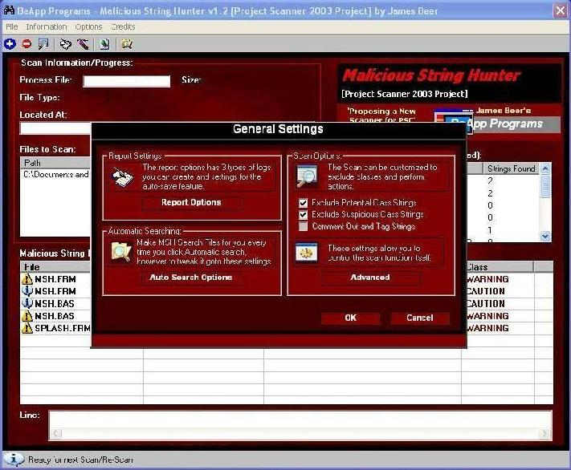



## Malicious String Hunter \- Basic Edition

### Description

A Complete Version of MSH Project Scanner has finally been developed, A NEW Feature and GUI Layout. Now this feature can search a whole Disk Drive for Projects and scan the files listed inside them automatically, only one click and all the rest is done for you.

(Customize the Auto-Search Options to enable/disable settings)

If you Like the last version, you'll love this one! Please VOTE for it and give some feedback about it.

BTW: Hope you like the color scheme, It meant to be mean looking.
 
### More Info
 

             |
---                |---
**Submitted On**   |2003-01-17 09:44:56
**By**             |[James Beer](https://github.com/Planet-Source-Code/PSCIndex/blob/master/ByAuthor/james-beer.md)
**Level**          |Intermediate
**User Rating**    |5.0 (35 globes from 7 users)
**Compatibility**  |VB 6\.0
**Category**       |[Complete Applications](https://github.com/Planet-Source-Code/PSCIndex/blob/master/ByCategory/complete-applications__1-27.md)
**World**          |[Visual Basic](https://github.com/Planet-Source-Code/PSCIndex/blob/master/ByWorld/visual-basic.md)
**Archive File**   |[Malicious\_1530711172003\.zip](https://github.com/Planet-Source-Code/james-beer-malicious-string-hunter-basic-edition__1-42512/archive/master.zip)

